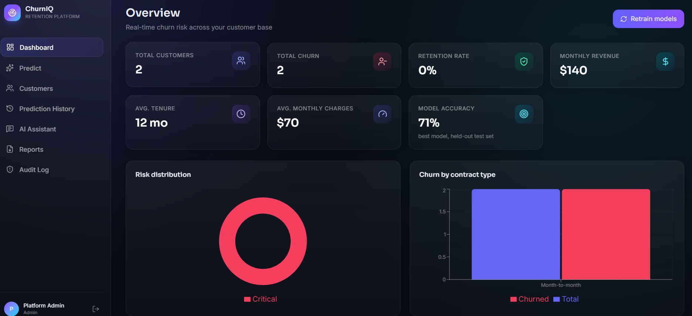
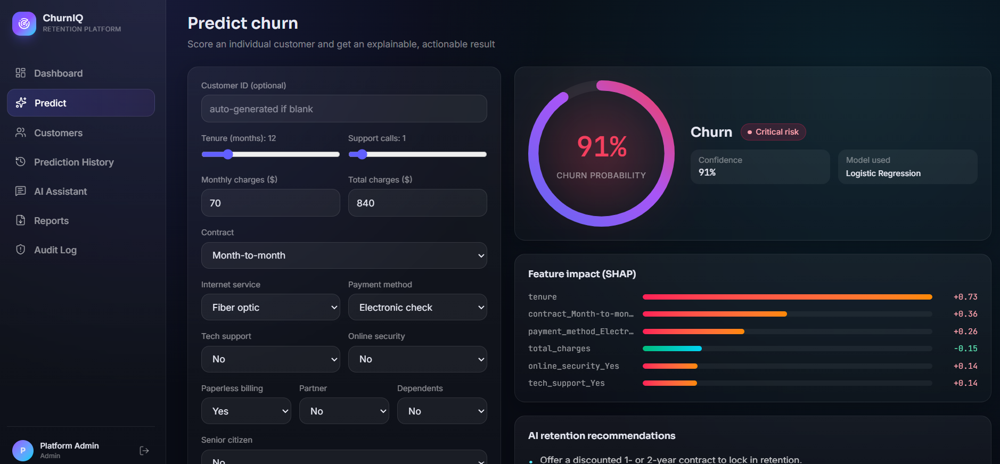
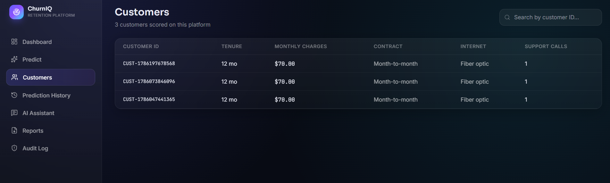
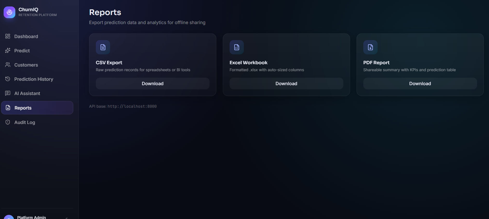
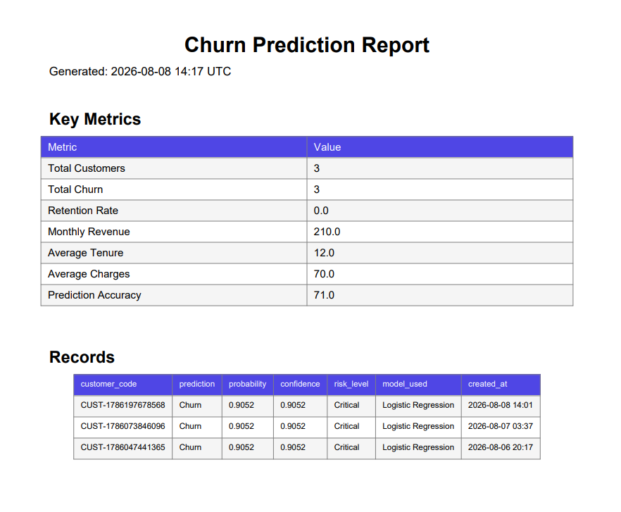

# ChurnIQ — AI Customer Churn Prediction Platform

An enterprise-style churn prediction platform: a FastAPI ML backend that trains
and compares five model types, explains predictions with SHAP, and serves an
AI retention assistant — plus a React/TypeScript SaaS dashboard with a
glassmorphism/gradient UI.

## Stack

- **Backend:** FastAPI, SQLAlchemy, scikit-learn, XGBoost, SHAP, JWT auth
- **Frontend:** React 19, Vite, TypeScript, Tailwind CSS v4, Recharts, Framer Motion
- **Database:** PostgreSQL (SQLite by default for zero-config local dev)
- **Deployment:** Docker + Docker Compose + Nginx

## Quick start — Docker (recommended)

```bash
docker compose up --build
```

Then open **http://localhost** — the Nginx proxy serves the frontend and
routes `/api/*` to the backend on the same origin. Postgres and Redis run as
their own containers; the backend automatically creates tables and a default
admin account on first boot.

**Demo login:** `admin@churnai.com` / `Admin@12345`

Optional: set `OPENAI_API_KEY` in a `.env` file at the repo root before
`docker compose up` to upgrade the AI Assistant from grounded-template
answers to full LLM responses (it works without this — see
[AI Assistant](#ai-assistant) below).

## Quick start — local development (no Docker)

### Backend

```bash
cd backend
python -m venv .venv && source .venv/bin/activate   # optional but recommended
pip install -r requirements.txt
python -m app.ml.train        # trains and saves the first model (~2s, synthetic data)
uvicorn app.main:app --reload
```

The API runs at `http://localhost:8000`. Interactive docs: `http://localhost:8000/docs`.
By default it uses a local SQLite file (`churn_platform.db`) — no database
setup required. To use Postgres instead, set `DATABASE_URL` (see `.env.example`).

### Frontend

```bash
cd frontend
npm install
npm run dev
```

Runs at `http://localhost:5173` and talks to the backend at
`http://localhost:8000` (configured in `frontend/.env`).

## 📸 Screenshots

### 📊 Dashboard


### 🎯 Customer Churn Prediction


### 👥 Customer Management


### 📄 Reports


### 📑 PDF Report

## Project structure

```
AI-Customer-Churn/
├── backend/
│   ├── app/
│   │   ├── main.py              # FastAPI app, CORS, router wiring, admin seeding
│   │   ├── ml/
│   │   │   ├── generate_data.py # synthetic churn dataset generator
│   │   │   ├── preprocessing.py # shared feature pipeline (train + inference)
│   │   │   ├── train.py         # trains & compares 5 models, saves the best
│   │   │   └── predict.py       # inference + SHAP explanation + risk + recs
│   │   ├── database/            # SQLAlchemy models & session
│   │   ├── auth/                # JWT, password hashing, role guards
│   │   ├── schemas/              # Pydantic request/response models
│   │   ├── services/             # chat assistant, report (CSV/Excel/PDF) builders
│   │   └── routers/              # auth, predict, train, dashboard, customers,
│   │                              # reports, chat, audit-logs
│   ├── requirements.txt
│   └── Dockerfile
├── frontend/
│   ├── src/
│   │   ├── pages/                # Dashboard, Predict, Customers, History,
│   │   │                          # Assistant, Reports, Audit Log, Login
│   │   ├── components/           # ChurnRing (signature gauge), KpiCard,
│   │   │                          # RiskBadge, GlassCard
│   │   ├── layouts/AppLayout.tsx # sidebar nav shell
│   │   ├── context/AuthContext.tsx
│   │   └── services/api.ts       # typed Axios client
│   └── Dockerfile
├── docker/nginx.conf             # root reverse proxy (routes /api → backend)
├── docker-compose.yml
└── README.md
```

## What's implemented

- **ML pipeline:** Logistic Regression, Decision Tree, Random Forest, Gradient
  Boosting, XGBoost — trained, cross-validated, and compared automatically;
  the best model (by F1) is persisted and used for inference.
- **Explainability:** every prediction returns SHAP-based feature
  contributions (model-appropriate explainer: Tree/Linear/generic fallback).
- **AI Assistant:** answers questions about a prediction ("why will this
  customer churn?", "what should we do?"). Works with **zero configuration**
  using grounded template responses built directly from the SHAP output —
  set `OPENAI_API_KEY` to upgrade to free-form LLM answers over the same
  grounded context.
- **Auth:** JWT login/register/forgot-password/reset-password, role-based
  access (`admin` / `analyst` / `manager`).
- **Dashboard:** KPIs, risk distribution, churn-by-contract chart.
- **Customers:** searchable, paginated customer list.
- **Prediction history & audit log** (audit log is admin-only).
- **Reports:** CSV, Excel, and PDF export of prediction data.
- **UI:** glassmorphism SaaS design, gradient accents, the "Churn Ring" —
  an animated gradient gauge used as the platform's signature visual.

## What's intentionally left as a next step

- Real-time notifications and Celery background jobs (Redis is wired into
  `docker-compose.yml` and ready for this, but no consumer is implemented yet).
- RAG-based FAQ retrieval (the AI Assistant is grounded in SHAP output per
  prediction rather than a document corpus).
- Email delivery for password resets (the reset endpoint returns the token
  directly in the API response for local testing — see the comment in
  `backend/app/routers/auth_router.py`; swap in a real mail provider before
  shipping to production).

## Security notes before deploying

- Set a strong, unique `JWT_SECRET_KEY` (the app auto-generates a random one
  each boot if unset — fine for local dev, **not** safe across restarts/multiple
  instances in production).
- Change the seeded admin password after first login.
- Tighten `allow_origins` in `backend/app/main.py` CORS middleware from `*`
  to your actual frontend origin(s).
